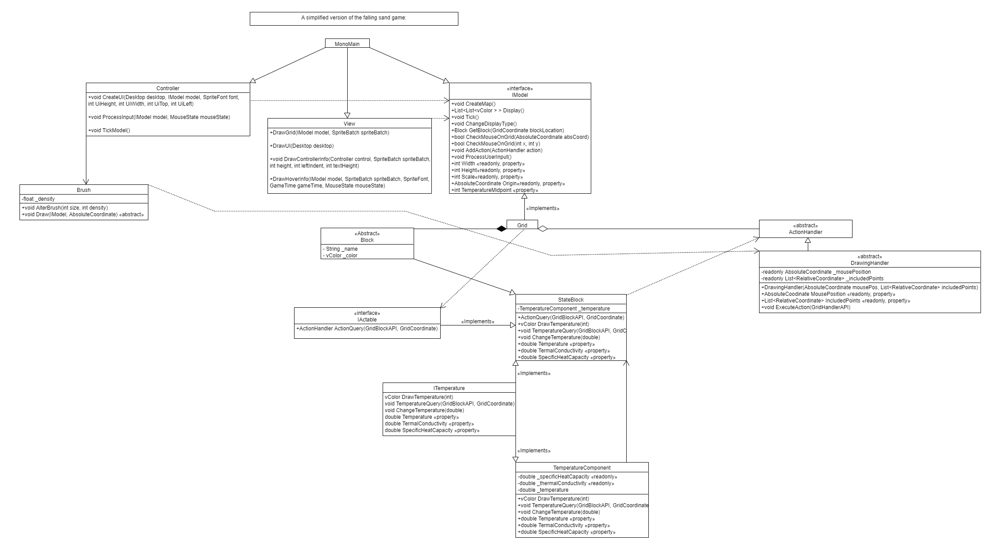

# Falling Sand Game
My Falling sand game was created for unit COS20007 as the end of semester project (semester 2 2020). The project was made in first year and had to fit certain design criteria that limited the methods I could use to optimize the game. The project has been included as an example project for the unit.

Incomplete UML diagram (A full UML diagram would be unreadable):

