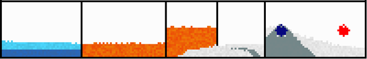

# Falling Sand Game
My Falling sand game was created for unit COS20007 as the end of semester project (semester 2 2020). The project was made in first year and had to fit certain design criteria that limited the methods I could use to optimize the game. The project has been included as an example project for the unit.

# Falling Sand Game  - Design Report
## Source code and precompiled versions:
I encourage you to download and try the game as it is much easier to understand certain interactions when you can watch them take place. Precompiled versions can be found in [releases](/releases/latest).

## Overview:
For my custom project I intended to create a game in the falling sand game genre. This genre consists of games where materials such as sand, stone, and water are represented on a 2D grid and given actions different materials can perform such as falling. Although not strictly followed, the original concept for performing these actions was the idea of cellular automata and creating complex interactions via simple rules. Some notable examples of this genre are noita, sandspiel, and powder toy.
I chose to create a game in this genre as it seems to lend itself to object oriented design with each tile on the 2D grid being an object and inheritance being used to add functionality to blocks in an extensible manner.

## Functionality:
### The main view:
\
•	Play / Pause is used to toggle if the simulation is paused.\
•	Next view mode is used to change between temperature and normal view.\
•	Toggle brush mode is used to change between a block brush and a temperature brush\
•	Reset resets the grid\
•	Clone block toggles the block brush painting with clone blocks (that produce the selected block)\
•	Brush size determines the size of the brush\
•	Brush strength determines what portion of the block brush should paint and what temperature the temperature brush should change blocks by\
•	Thermal midpoint determines the temperature in the middle of the range in temperature view

## Top left information readout:
\
•	ms/t is the total time it takes to execute a tick. FPS is the number of ticks performed each second\
•	PX and PY are the pixel position of the mouse cursor\
•	GX and GY are the grid position of the mouse cursor\
•	Block returns the name of the block at the location of the mouse cursor\
•	Temp returns the temperature in kelvin of the block at the location of the mouse cursor\
•	Density returns the density of the block at the location of the mouse cursor

## Mouse Cursor functionality:
If the Block brush is selected, left click will place blocks into the world and right click will erase blocks from the world.

If the Temperature brush is selected left click will increase the temperature of blocks included in the brush’s radius and right click will do the inverse.

## Examples of block functionality:
This is not a comprehensive list of all functionalities but provides some of the best examples.

### Dirt
\
Dirt is affected by gravity and turns to mud if covered by water. If it is touching water but not covered it will turn to grass which may spread to nearby dirt.

### Meteor
\
Meteors will fall directly downwards. If they make contact with an impassable block such as another solid block they will explode. While the fall they release smoke and fire.

### Wood
\
Wood is affected by gravity and when in contact with a burning substance catches fire. Fire only survives when in contact with oxygen and produces embers which in turn produce smoke.

### Smoke
\
Smoke is a light gas that is created by many substances. If cooled sufficently it will turn to ash, a light solid, or may turn to carbon dioxide.

### Seeds
\
The seed block has the capacity to grow a number of different plants. The Seed block can produce cellular automota to create algue when in contact with water, multiple variants on trees, and flowers of varying sizes and shapes. These plants will also turn carbon dioxide into oxygen.

### Acid
\
Acid is a color changing material that eats any other solid or liquid blocks with a small chance to create more of itself when it does so. It is flamable.

## Temperature Simulation
\
My game includes a complex temperature simulation where blocks have a specific heat capacity, temperature, and thermal conductivity (a value representing how quickly temperatures should change when in contact with a block of different temperature). In the above example there are two constant temperature blocks (top is 10K bottom is 3000K) and the funnel of heat is air of different temperatures moving.

Some more temperature interactions (from left to right):

Ice floating on water, lava in a hot cell, lava and liquid oxygen divided by glass (an amazing insulator), and a hot and cold source sitting horizontal in a box.\
\
With a lower temperature midpoint:\
\
Higher temperature midpoint:\
\

## Emergent Behaviour
One core aspect essential to falling sand games is that the simple checks used to perform actions should create emergent complex behavior.

### Density determining how materials arrange themselves

\
Blocks compare density to determine if they should sink or float meaning oil (which is less dense than water) will float while stone (which is more dense than water) will sink. In the second example hydrogen gas sits at the top of the window with smoke (which is more dense) sitting below it and some carbon dioxide (same color as air) at the bottom of the window.

### Fire starved for oxygen
\
Fire requires oxygen to stay lit so if another gas such as nitrogen has displaced the oxygen in an area the fire will be unable to spread to that area. In the above picture the right side of the coal on the screen is covered in nitrogen.

### Convection

\
In this case water is heated at the bottom by a hot element, turns to steam and floats to the top of the screen where it is cooled by a cool element where it transitions back to water and falls back to the hot element.

In the second example a heatsink is used to remove heat that is generated by a element at the bottom of the container and transported to the top of the container via water – emulating a real world heat pipe.

# Design:
## Fundamental Design:
To create the fundamental aspect of a falling sand game two questions, need to be answered; How should blocks determine if they should be updated, and how should blocks be updated.

Firstly, I chose to give blocks the ability to determine if they should be updated. This has the significant advantage that functionality is defined by the block and thus new blocks can implement unique functionality. This is an extensible design that avoids code duplication as if an action is performed on many blocks, such as gravity, those blocks may inherit from a parent class that contains that functionality.

Secondly, I chose to not allow blocks to change or update the grid directly. If blocks could update the grid, they would need to know a significant amount of information about the grid making the blocks strongly related to the grid. Instead blocks create ActionHandlers, objects that contain the ability to update the grid in certain manners. These objects are returned to the grid where the grid can execute them effectively separating the conditions of an event from the event itself. This is a highly extensible design as if I have different conditions that result in the same action, I can define those conditions in the block classes and define the action in an ActionHandler class.

This UML diagram represents the essential aspects of this design within my code:
\
The grid class holds the grid of blocks and loops through all blocks each tick to update them.

The IActable interface is used to define blocks that have functionality.

The Stateblock inherits from the base block class and includes functionality.

The GridBlockAPI is an object that holds a reference to the grid and holds functionality that can be accessed by block objects. This is not an interface as it expands on the functionality within the grid class itself while also limiting access. A similar object, GridHandlerAPI exists between the grid and ActionHandlers but is not pictured here.

## Composition:
This essential design however has a key issue that became apparent during development. If two objects that inherit from different parent classes implement the same behavior, then code duplication is required. To solve this, I implemented composition for some of the most common functionality such as temperature:\

## Coordinates:
Another important aspect of design is my choice on how to handle coordinates. While handling all coordinates through inbuilt classes such as vector2 is a reasonable solution I chose to avoid this as a vector2 that represents the location on the grid would be able to be used in a method that requires a location on the window without a compiler error. Instead for my Program I decided to create 3 different coordinate structs that each represent a different type of coordinate:

Absolute coordinates represent a pixel position on the window. 

Grid coordinates represent a location in the 2D array stored by the grid.

Relative coordinates represent a location relative to 0, 0.

This flexibility of creating my own coordinate system proved essential as I transitioned away from splashkit to monogame late in the project. Without my own coordinate system many methods would have required rewrites to use a new coordinate system that did not rely on splashkit’s point2D.

Relative coordinates also serve to significantly reduce the coupling of blocks and the grid as blocks do not know their own location. If blocks must know about blocks around them they hold relative coordinate values that can be translated to grid coordinates when ActionQuery() is called.

I chose to create these as structs due to data in a struct being stored sequentially within the heap instead of storing pointers to data randomly in the heap. This, according to this article, can have a significant impact on performance of creating a data structure to hold x and y values. 

Each coordinate struct also contains a method which is somewhat unorthodox. In C# methods on structs are stored as managed pointers and the CLI passes a reference of the struct to the method meaning these methods should not influence performance.\

## MonoGame and SplashKit:
This project was conceived and built in SplashKit. However, SplashKit is highly unoptimized and due to that, drawing the rectangles that represent each block cost 20% of the overall performance of the program. To solve this issue, I either needed to draw the rectangles using the GPU or multithread the drawing aspect of the program.

I elected to port the project to Mono Game, a much more advanced and mature framework based on Microsoft’s no longer developed framework XNA, where I could easily take advantage of the GPU minimizing performance issues related to the drawing of the grid. I also took advantage of the UI library myra to simplify the UI creation process as it is not the focus of this project. This had the somewhat dramatic effect that Mono Game is built around the MVC pattern and hence the program needed to be altered to utilize this.

The model code is included in a separate DLL and public interfaces are used wherever possible to hide the model’s functionality while all other classes are internal meaning they are not available outside the binary.

An example of the publicly facing interface for the grid:\

The view and controller code are part of the Mono Game DLL:\

## Brushes and DrawingHandlers:
One issue I faced in design was separating the controller from the model. The controller should not directly be able to make changes to the grid however, some method is required so that user can draw blocks onto the grid.

Firstly, since ActionHandlers exist to make changes to the grid, I defined DrawingHandlers that inherit from ActionHandler as their parent class. This has similar advantages to other action handlers as it also serves to minimize code replication by defining functionality once. The Drawing Handler UML:\
\
However, DrawingHandlers require knowledge of internal components that are not exposed to the controller so a class is required that has access to the internal components for creating DrawingHandlers and is publicly accessible meaning it can be used by the controller. This class is the brush class.

Brushes are public classes that hold a list of points, the functionality to change that list of points, and any functionality needed to create a DrawingHandler. UML for brush classes:\

Block brushes hold a list of all blocks the user can draw and draws those to the screen.

Temperature brush holds a temperature differential which is used to change the temperature of selected blocks.
Eraser brush replaces any selected blocks with air.

Together this creates a strong and extensible system where the controller is exposed a minimum of information, the brush handles the functionality surrounding the creation of a DrawingHandler, and the DrawingHandler performs actions on the grid. A UML showing the general structure of this process:\

## Performance
Fundamentally falling sand games pose a significant performance challenge. For the main version of the game I simulate 150000 blocks and 146502 of those can perform actions meaning they must read in the blocks around them, check for actions, and the actions must be executed by an action handler. To maintain 60fps this must happen in 10ms with an additional 6ms being reserved for drawing the grid. Hence a significant portion of time on this project focused on achieving reasonable performance. Some major changes that were made to achieve this goal were:

1.	Removing the creation of dictionaries within tight loops\
2.	Minimizing the number of boxing operations performed within the loop\
3.	Cashing values such as block’s color to alleviate required computation\

While this reaches an acceptable level of performance, a certain aspect of the fundamental design significantly limit performance. The IActable interface may serve to create extensible code however it entails a cast from Block objects to IActable objects before the ActionQuery method can be called which involves boxing the Block object and causing a significant performance issue (around 3ms). Similar performance issues are experienced when utilizing the ITemperature interface (around 4ms). These issues may be solved by creating properties that describe what features a block may or may not have at the cost of some extensibility.

